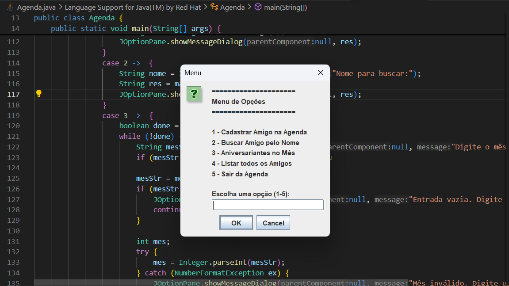

# 📓 contacts-list-app
A Java contacts list app using Java and basic I/O implementations. This project was developed for a 4th Semester Bachelors degree in Computer Engineering assignment (Object Oriented Programming).

---

### 💻 Execution
To execute the application, you must run `Agenda.java`.

---

### 📝 Summary

The project is designed to create a simple friend list program, that allows the user to add, and view friends. The registering process requests for some personal information, which is then stored and displayed using ArrayLists. 

This project was useful for learning basic java language features.

---

### ⚙️ Features

The user must input one of the following 5 numbers into the input field in order to progress:

1. *"Cadastrar Amigo na Agenda":* allows the user to register a new friend.
2. *"Buscar amigo pelo Nome":* allows the user to search their friends list by using a name query.
3. *"Aniversariantes do mês":* displays friends whose birthdays are due in the current month.
4. *"Listar todos os amigos":* displays a list cotaining all of user's friends.
5. *"Sair da agenda":* Exits the application.
